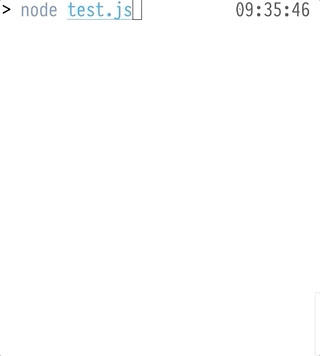
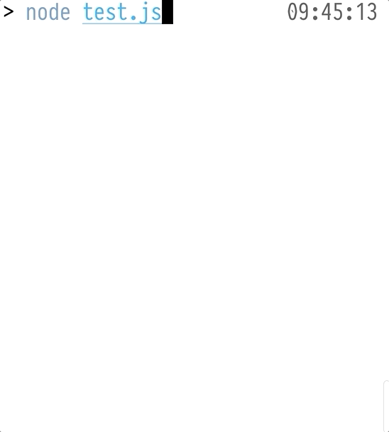

# Bending Time with RxJS
### __*#FullStack*____2019__

[.footer: @_maxgallo]

---


# Hi 👋🏻
#[fit] I'm __Max__ Gallo


_Principal Engineer_ @ DAZN

<br/>
_twitter:_ @\_maxgallo
_more:_ maxgallo.io

---

# [fit] Agenda

1. Using Schedulers
2. Microtask and Macrotask
3. Bending Time

---

```javascript
const { of } = require('rxjs');

const observer = {
    next(value) {
        console.log(value);
    }
}

of(1, 2, 3, 4)
	.subscribe(observer);

console.log('subscribe');
```

<br />

__*USING*__ __NO SCHEDULER__ __*The Output is*__  1__,__ 2__,__ 3__,__ 4__,__ subscribe

---

[.code-highlight: 1,9]

```javascript
const { of, scheduled, asapScheduler } = require('rxjs');

const observer = {
    next(value) {
        console.log(value);
    },
}

scheduled(of(1, 2, 3, 4), asapScheduler)
  .subscribe(observer);

console.log('subscribe');
```
<br />

__*USING*__ __ASAP SCHEDULER__ __*The Output is*__ subscribe__,__ 1__,__ 2__,__ 3__,__ 4

---

[.code-highlight: 1,9]

```javascript
const { of, scheduled, asyncScheduler } = require('rxjs');

const observer = {
    next(value) {
        console.log(value);
    },
}

scheduled(of(1, 2, 3, 4), asyncScheduler)
  .subscribe(observer);

console.log('subscribe');
```
<br />

__*USING*__ __ASYNC SCHEDULER__ __*The Output is*__ subscribe__,__ 1__,__ 2__,__ 3__,__ 4

---

# recap 🤔

|  |  |
| :---: | :---: |
| no scheduler | 1__,__ 2__,__ 3__,__ 4__,__ subscribe |
| __asap Scheduler__ | subscribe__,__ 1__,__ 2__,__ 3__,__ 4 |
| __async Scheduler__ | subscribe__,__ 1__,__ 2__,__ 3__,__ 4 |

---

LETS __RACE__ THEM  🏎 💨

---

```javascript
const {
    of, merge, scheduled,
    asapScheduler,
    asyncScheduler,
    queueScheduler,
} = require('rxjs');

const observer = {
    next(value) {
        console.log(value);
    },
}

const asapObs = scheduled(of('ASAP'), asapScheduler)
const asyncObs = scheduled(of('ASYNC'), asyncScheduler)
const queueObs = scheduled(of('QUEUE'), queueScheduler)

merge(asapObs, asyncObs, queueObs)
  .subscribe(observer);

console.log('SUBSCRIBE');

```
__*The Output is*__ queue__,__ subscribe__,__ asap__,__ async

---

# Scheduler Types

| __*Type*__ | __*Execution*__ | 
| --- | --- | --- |
| queue | Sync |
| asap | Async → microtask | 
| async | Async → macrotask |
| animationFrame	 | before next repaint | 

---

# [fit] __*Deep Dive*__ __Macrotasks__ __*&*__ __Microtasks__

## Two Queues of the event loop 

```
MACROtasks     MICROtasks 
----------     ----------
setTimeout     process.nextTick
setInterval    Promises
setImmediate   MutationObserver
I/O tasks

```

---

# [fit] __*Deep Dive*__ __Macrotasks__ __*&*__ __Microtasks__

<br/>

For every __macrotask__ removed from the __MACRO__-queue,
all the __microtasks__ are removed from the __MICRO__-queue.


*(how to remember: 👩‍✈️ 🛂 ✈️)*

[.footer: to learn more whatch [https://www.youtube.com/watch?v=u1kqx6AenYw](https://www.youtube.com/watch?v=u1kqx6AenYw) and read [https://jakearchibald.com/2015/tasks-microtasks-queues-and-schedules/](https://jakearchibald.com/2015/tasks-microtasks-queues-and-schedules/)]

---

# [fit] Schedulers control the __order__ of event emission

---

```javascript
const { interval } = require('rxjs');
const { take } = require('rxjs/operators');

const observer = {
    next(value) {
        console.log(value);
    }
}

interval(1000)
    .pipe(take(3600))
    .subscribe(observer);
```



---

[.code-highlight: 3,7,15, 19]

```javascript
const {
	interval,
	VirtualTimeScheduler
} = require('rxjs');
const { take } = require('rxjs/operators');

const scheduler = new VirtualTimeScheduler();

const observer = {
    next(value) {
        console.log(value);
    }
}

interval(1000, scheduler)
    .pipe(take(3600))
    .subscribe(observer);

scheduler.flush();

```



---

# [fit] Schedulers control the __speed__ of event emission

---
__*Takeaways*__


# Schedulers control the __order__ and the __speed__ of event emission

---
<br/>
# [fit] __*Thank you*__ 🙏

# Bending time with __RxJS__

@_maxgallo